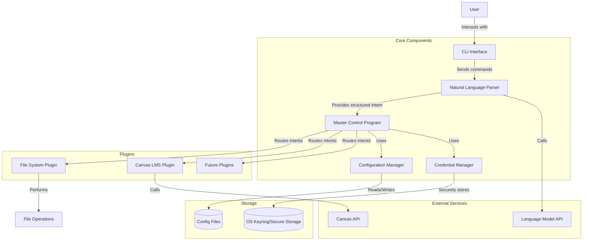
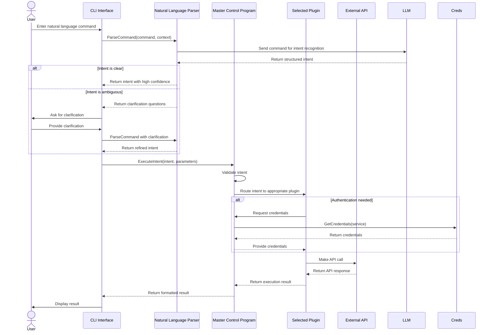
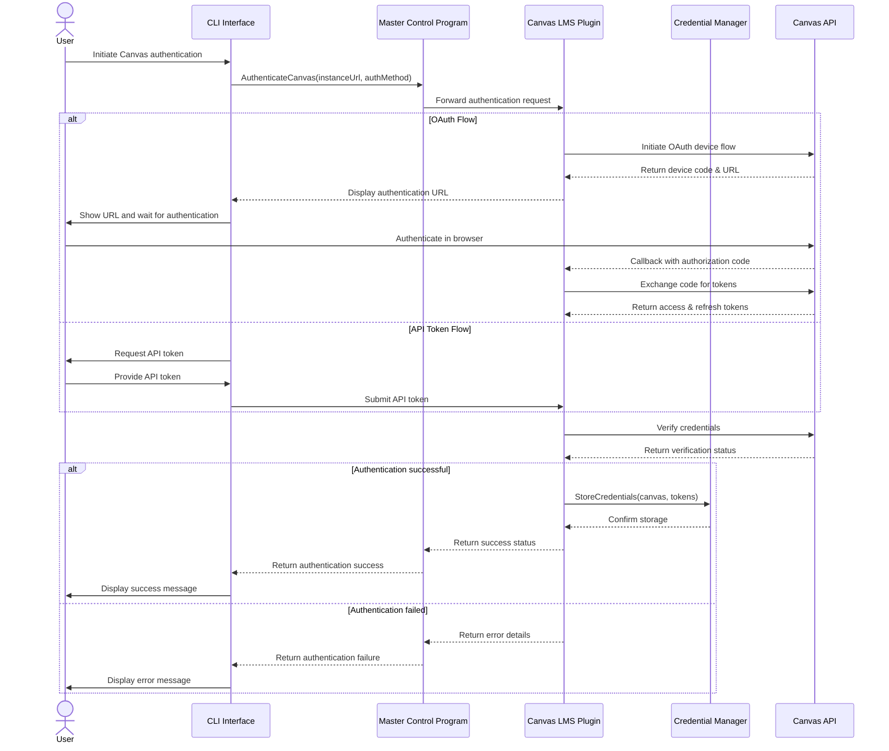
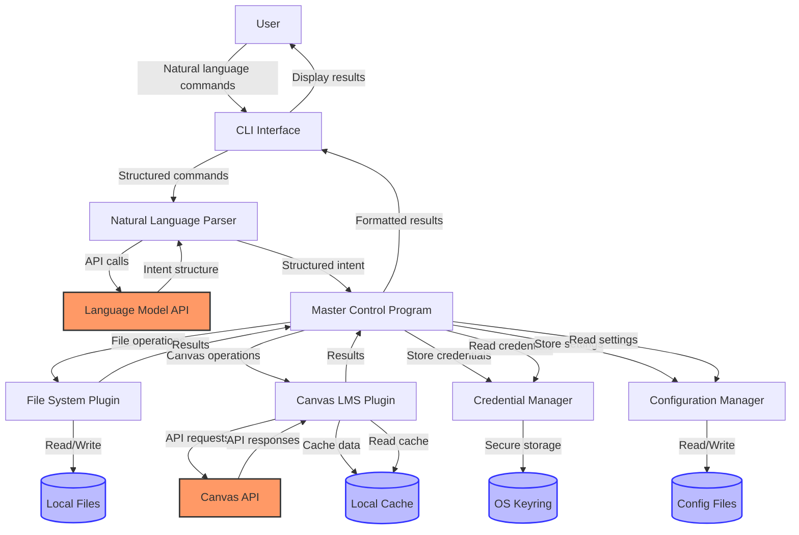
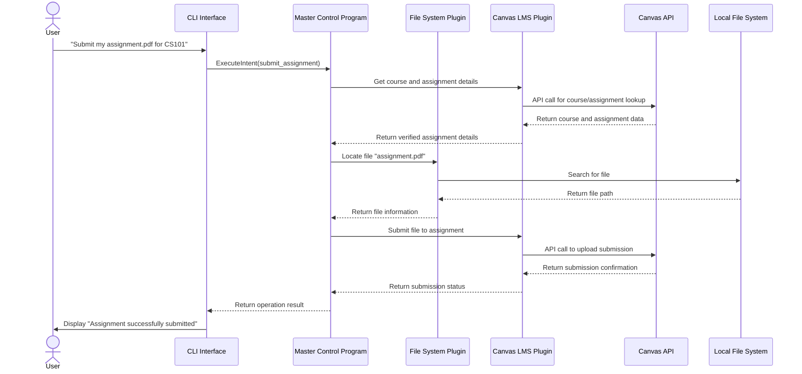

# Project Requirements
> Main Language in use: Golang. 

Functional Requirements
Natural-language CLI input: accept free-form commands (e.g. “Get my assignments”) and map to structured intents.
Intent parsing: use an LLM or parser to convert input into JSON-like intent+parameters, with validation and clarification prompts if needed.
MCP orchestration: dispatch validated intents to the correct module/service (e.g., file system or Canvas).
File-system module: support listing, reading, writing, deleting, moving, searching files via natural-language commands, with confirmation for destructive actions.
Canvas LMS module: authenticate via OAuth2 or token; support fetching assignments, deadlines, grades, downloading/uploading submissions, listing calendar events, posting messages if permitted.
Interactive flows: handle multi-step tasks (e.g. choose course, pick file, confirm upload).
Help/usage: provide example phrases, “help” command listing available intents per module.
Logging: record commands, API calls, responses for debugging; support dry-run mode.
Configuration: allow base Canvas URL, OAuth client info, default course or folder paths, LLM API settings, module registry in a config file.


Non-Functional Requirements
Responsiveness: local parsing <100ms; show progress for network calls; overall CLI feedback within a few seconds for common operations.
Reliability: handle network errors, token expiry, API rate limits with retries and clear user messages.
Extensibility: plugin interface for additional MCP modules; discover modules via config without changing core code.
Usability: clear error messages; interactive REPL with autocomplete/history; verbose/debug modes for troubleshooting.
Portability: cross-platform support for CLI (Windows, macOS, Linux); handle OS file paths consistently.
Resource usage: keep modules lightweight; manage LLM API calls to avoid excessive cost/latency; optional caching with TTL.
Security Requirements
Authentication: OAuth2 device flow or token for Canvas; minimum-scopes only.
Credential storage: encrypt tokens at rest (OS keyring or encrypted local store).
Transport security: use HTTPS for all API calls.
Access control: verify Canvas permissions before write operations; confirm destructive file ops.
Logging/privacy: avoid logging sensitive details or allow user to purge/disable sensitive logs.
Input validation: sanitize file paths; prevent directory traversal.
Dependency management: keep libraries up to date; verify plugin integrity.


Performance & Availability
Local parsing and dispatch must be near-instant.
Canvas API calls: handle paginated requests and rate limits; cache results where appropriate.
CLI should detect offline state and inform user or serve cached data.
Optional background scheduling for periodic tasks (e.g. checking new assignments) with minimal resource use.


Integration Requirements
Canvas API: support configurable base URL; manage OAuth2 flow; handle pagination, rate limits; use REST endpoints.
LLM/intent parser: read API keys from environment or secure store; validate parsed intents against schemas.
MCP interface: define simple JSON-over-HTTP or gRPC between CLI core and module services; register modules via config.
File-system: access OS file APIs safely across platforms.
Optional: integrate with notification systems (desktop or email), calendar (e.g. Google Calendar), version control (e.g. Git), scheduler (cron or internal).
Config management: use a user config file (~/.cli-agent-config) with overrides via environment variables.
Testing: support mocks or sandbox Canvas instance; unit tests for intent parsing and module logic.


Deployment Requirements
Package CLI and modules as static binaries or installer; provide shell completion scripts.
Provide a setup command to guide initial Canvas authentication and test connectivity.
Versioning: follow semantic versioning; include migration steps for config changes.
Documentation: include quickstart guide, example commands, troubleshooting tips.


# Project Design Document

## Initial Analysis and Brainstorming

# Canvas CLI Agent Implementation Plan

## Core Critical High-Impact Decisions

### 1. Natural Language Processing Approach

**Options:**

A. **Use OpenAI API (GPT-4/3.5) for Intent Parsing**
- Pros:
  - High accuracy in understanding natural language
  - Quick implementation (minimal training needed)
  - Handles edge cases and variations in language well
  - Regular improvements via API updates
- Cons:
  - API costs for production usage
  - External dependency and potential latency
  - Privacy concerns with sending user commands externally

B. **Local LLM (e.g., Llama 2)**
- Pros:
  - No ongoing API costs
  - No external network dependency
  - Better privacy (all processing local)
- Cons:
  - Higher resource requirements
  - Potentially lower accuracy than cloud models
  - More complex deployment

C. **Rule-based/Regex Parser with Pre-defined Patterns**
- Pros:
  - No external dependencies
  - Fast execution
  - No API costs
- Cons:
  - Limited flexibility
  - Higher development effort to handle variations
  - Harder to maintain and extend

**Decision:** Option A (OpenAI API) for initial implementation with option to switch to B (Local LLM) later. This provides the best balance of accuracy, development speed, and flexibility. We'll implement an abstraction layer to make switching LLM providers easier in the future.

### 2. Architecture Pattern

**Options:**

A. **Monolithic CLI Application**
- Pros:
  - Simpler deployment (single binary)
  - Lower operational complexity
  - No inter-service communication overhead
- Cons:
  - Less modular
  - Harder to scale individual components
  - All dependencies bundled together

B. **Microservices with Core Orchestrator**
- Pros:
  - Better separation of concerns
  - Independent scaling of components
  - Modules can be developed/deployed separately
- Cons:
  - More complex deployment
  - Network communication overhead
  - More moving parts to manage

C. **Plugin-based Architecture**
- Pros:
  - Core stays lightweight
  - Modules loaded on demand
  - Extensible without modifying core
- Cons:
  - More complex plugin interface design
  - Potential version compatibility issues
  - More complex testing

**Decision:** Option C (Plugin-based Architecture) provides the best balance of extensibility and simplicity. The core MCP will handle intent parsing and orchestration, with modules implemented as plugins that conform to a well-defined interface.

### 3. Canvas API Integration Method

**Options:**

A. **Direct REST API Integration**
- Pros:
  - Full control over API calls
  - No additional dependencies
  - Can optimize for specific use cases
- Cons:
  - More development effort
  - Need to handle pagination, rate limiting manually
  - Requires keeping up with API changes

B. **Use Existing Canvas SDK/Library**
- Pros:
  - Faster development
  - Handles common patterns (pagination, errors)
  - Potentially maintained by community
- Cons:
  - Additional dependency
  - May not cover all needed endpoints
  - Less control over implementation details

**Decision:** Option A (Direct REST API Integration) since there isn't a comprehensive, well-maintained Golang SDK for Canvas. We'll build a lightweight client that handles authentication, pagination, and rate limiting.

### 4. Credential Storage

**Options:**

A. **OS Keyring/Credential Manager**
- Pros:
  - Platform-native security
  - No need to implement encryption
  - User-specific storage
- Cons:
  - Different implementations across platforms
  - May require additional permissions
  - Harder to test

B. **Encrypted Local File**
- Pros:
  - Consistent across platforms
  - Full control over encryption
  - Portable
- Cons:
  - Need to implement secure encryption
  - Need to manage encryption keys
  - Potential for implementation errors

C. **Environment Variables**
- Pros:
  - Simple implementation
  - No persistent storage
  - Standard practice for many CLIs
- Cons:
  - Less secure (can be viewed in process list)
  - User needs to set them each session
  - Not suitable for persistent tokens

**Decision:** Option A (OS Keyring) as primary with Option B (Encrypted File) as fallback. This provides the best security while maintaining cross-platform compatibility.

## Low-Level Design Document

### 1. System Architecture

```
┌─────────────────────────────────────────┐
│                                         │
│               CLI Interface             │
│                                         │
└───────────────────┬─────────────────────┘
                    │
                    ▼
┌─────────────────────────────────────────┐
│                                         │
│          Natural Language Parser        │
│          (OpenAI API Adapter)           │
│                                         │
└───────────────────┬─────────────────────┘
                    │
                    ▼
┌─────────────────────────────────────────┐
│                                         │
│      Master Control Program (MCP)       │
│                                         │
└───┬───────────────┬───────────────┬─────┘
    │               │               │
    ▼               ▼               ▼
┌─────────┐   ┌─────────────┐   ┌─────────┐
│         │   │             │   │         │
│ File    │   │ Canvas      │   │ Other   │
│ System  │   │ LMS         │   │ Plugins │
│ Plugin  │   │ Plugin      │   │         │
│         │   │             │   │         │
└─────────┘   └─────────────┘   └─────────┘
```

### 2. Component Details

#### 2.1 CLI Interface

- Implements a REPL (Read-Eval-Print Loop) for interactive use
- Provides command history and autocomplete
- Handles initial configuration and setup
- Manages user feedback and progress indicators

**Implementation:**
```go
package main

import (
    "github.com/spf13/cobra"
    "github.com/your-org/canvas-cli/core"
    "github.com/your-org/canvas-cli/parser"
)

func main() {
    // Initialize components
    config := core.LoadConfig()
    nlParser := parser.NewOpenAIParser(config.OpenAIKey)
    mcp := core.NewMCP(config, nlParser)
    
    // Register plugins
    mcp.RegisterPlugin("filesystem", plugins.NewFileSystemPlugin())
    mcp.RegisterPlugin("canvas", plugins.NewCanvasPlugin(config.CanvasURL, config.CanvasToken))
    
    // Start REPL or process command
    if len(os.Args) > 1 {
        mcp.ProcessCommand(strings.Join(os.Args[1:], " "))
    } else {
        repl := core.NewREPL(mcp)
        repl.Start()
    }
}
```

#### 2.2 Natural Language Parser

- Converts natural language to structured intents
- Validates and normalizes parameters
- Handles ambiguity and requests clarification when needed

**Implementation:**
```go
package parser

import (
    "context"
    "github.com/sashabaranov/go-openai"
)

type Intent struct {
    Action     string                 `json:"action"`
    Module     string                 `json:"module"`
    Parameters map[string]interface{} `json:"parameters"`
    Raw        string                 `json:"raw"`
}

type OpenAIParser struct {
    client *openai.Client
}

func NewOpenAIParser(apiKey string) *OpenAIParser {
    return &OpenAIParser{
        client: openai.NewClient(apiKey),
    }
}

func (p *OpenAIParser) Parse(input string) (*Intent, error) {
    prompt := `Parse the following command into a structured intent with module, action, and parameters.
Input: "` + input + `"
Output (JSON):`

    resp, err := p.client.CreateChatCompletion(
        context.Background(),
        openai.ChatCompletionRequest{
            Model: openai.GPT3Dot5Turbo,
            Messages: []openai.ChatCompletionMessage{
                {
                    Role:    openai.ChatMessageRoleUser,
                    Content: prompt,
                },
            },
        },
    )
    
    if err != nil {
        return nil, err
    }
    
    // Parse JSON response into Intent
    var intent Intent
    err = json.Unmarshal([]byte(resp.Choices[0].Message.Content), &intent)
    if err != nil {
        return nil, err
    }
    
    intent.Raw = input
    return &intent, nil
}
```

#### 2.3 Master Control Program (MCP)

- Routes intents to appropriate plugins
- Manages plugin lifecycle and registration
- Handles cross-cutting concerns (logging, error handling)
- Implements interactive flows

**Implementation:**
```go
package core

import (
    "github.com/your-org/canvas-cli/parser"
    "github.com/your-org/canvas-cli/plugins"
)

type Plugin interface {
    GetName() string
    GetCapabilities() []string
    Execute(action string, params map[string]interface{}) (interface{}, error)
}

type MCP struct {
    config      *Config
    parser      *parser.IntentParser
    plugins     map[string]Plugin
    logger      *Logger
}

func NewMCP(config *Config, parser *parser.IntentParser) *MCP {
    return &MCP{
        config:  config,
        parser:  parser,
        plugins: make(map[string]Plugin),
        logger:  NewLogger(config.LogLevel),
    }
}

func (m *MCP) RegisterPlugin(name string, plugin Plugin) {
    m.plugins[name] = plugin
}

func (m *MCP) ProcessCommand(input string) (interface{}, error) {
    // Parse input to intent
    intent, err := m.parser.Parse(input)
    if err != nil {
        return nil, fmt.Errorf("failed to parse command: %w", err)
    }
    
    // Log the intent
    m.logger.Info("Parsed intent", "module", intent.Module, "action", intent.Action)
    
    // Find plugin
    plugin, exists := m.plugins[intent.Module]
    if !exists {
        return nil, fmt.Errorf("module '%s' not found", intent.Module)
    }
    
    // Execute intent
    result, err := plugin.Execute(intent.Action, intent.Parameters)
    if err != nil {
        return nil, fmt.Errorf("execution error: %w", err)
    }
    
    return result, nil
}
```

#### 2.4 File System Plugin

- Handles file operations (list, read, write, delete, move)
- Implements path validation and security checks
- Provides confirmation for destructive operations

**Implementation:**
```go
package plugins

import (
    "os"
    "path/filepath"
)

type FileSystemPlugin struct {
    baseDir string
}

func NewFileSystemPlugin() *FileSystemPlugin {
    homeDir, _ := os.UserHomeDir()
    return &FileSystemPlugin{
        baseDir: homeDir,
    }
}

func (p *FileSystemPlugin) GetName() string {
    return "filesystem"
}

func (p *FileSystemPlugin) GetCapabilities() []string {
    return []string{"list", "read", "write", "delete", "move", "search"}
}

func (p *FileSystemPlugin) Execute(action string, params map[string]interface{}) (interface{}, error) {
    switch action {
    case "list":
        return p.listFiles(params)
    case "read":
        return p.readFile(params)
    // Other actions...
    default:
        return nil, fmt.Errorf("unsupported action: %s", action)
    }
}

func (p *FileSystemPlugin) listFiles(params map[string]interface{}) (interface{}, error) {
    dir, ok := params["directory"].(string)
    if !ok {
        dir = "."
    }
    
    // Validate path
    fullPath := filepath.Join(p.baseDir, dir)
    if !strings.HasPrefix(fullPath, p.baseDir) {
        return nil, fmt.Errorf("access denied: directory outside base directory")
    }
    
    // List files
    entries, err := os.ReadDir(fullPath)
    if err != nil {
        return nil, err
    }
    
    var files []string
    for _, entry := range entries {
        files = append(files, entry.Name())
    }
    
    return files, nil
}

// Other methods for file operations...
```

#### 2.5 Canvas LMS Plugin

- Handles authentication with Canvas API
- Implements operations for assignments, grades, submissions
- Manages pagination and rate limiting

**Implementation:**
```go
package plugins

import (
    "net/http"
    "time"
)

type CanvasPlugin struct {
    baseURL    string
    token      string
    httpClient *http.Client
}

func NewCanvasPlugin(baseURL, token string) *CanvasPlugin {
    return &CanvasPlugin{
        baseURL: baseURL,
        token:   token,
        httpClient: &http.Client{
            Timeout: 10 * time.Second,
        },
    }
}

func (p *CanvasPlugin) GetName() string {
    return "canvas"
}

func (p *CanvasPlugin) GetCapabilities() []string {
    return []string{
        "list_courses", 
        "get_assignments", 
        "get_grades", 
        "submit_assignment",
        "list_events",
    }
}

func (p *CanvasPlugin) Execute(action string, params map[string]interface{}) (interface{}, error) {
    switch action {
    case "list_courses":
        return p.listCourses()
    case "get_assignments":
        return p.getAssignments(params)
    // Other actions...
    default:
        return nil, fmt.Errorf("unsupported action: %s", action)
    }
}

func (p *CanvasPlugin) listCourses() (interface{}, error) {
    req, err := http.NewRequest("GET", p.baseURL+"/api/v1/courses", nil)
    if err != nil {
        return nil, err
    }
    
    req.Header.Add("Authorization", "Bearer "+p.token)
    
    resp, err := p.httpClient.Do(req)
    if err != nil {
        return nil, err
    }
    defer resp.Body.Close()
    
    if resp.StatusCode != http.StatusOK {
        return nil, fmt.Errorf("API error: %s", resp.Status)
    }
    
    var courses []map[string]interface{}
    if err := json.NewDecoder(resp.Body).Decode(&courses); err != nil {
        return nil, err
    }
    
    return courses, nil
}

// Other methods for Canvas operations...
```

#### 2.6 Configuration Management

- Handles loading and saving configuration
- Manages secure storage of credentials
- Provides environment variable overrides

**Implementation:**
```go
package core

import (
    "os"
    "path/filepath"
    
    "github.com/zalando/go-keyring"
    "gopkg.in/yaml.v3"
)

type Config struct {
    CanvasURL     string `yaml:"canvas_url"`
    CanvasTokenID string `yaml:"canvas_token_id"` // ID for keyring lookup
    OpenAIKeyID   string `yaml:"openai_key_id"`   // ID for keyring lookup
    LogLevel      string `yaml:"log_level"`
    BaseDir       string `yaml:"base_dir"`
    
    // Runtime fields (not stored in config file)
    CanvasToken string `yaml:"-"`
    OpenAIKey   string `yaml:"-"`
}

func LoadConfig() *Config {
    // Default config path
    homeDir, _ := os.UserHomeDir()
    configPath := filepath.Join(homeDir, ".canvas-cli-config.yaml")
    
    // Override with env var if set
    if envPath := os.Getenv("CANVAS_CLI_CONFIG"); envPath != "" {
        configPath = envPath
    }
    
    // Default config
    config := &Config{
        LogLevel: "info",
        BaseDir:  homeDir,
    }
    
    // Load from file if exists
    if _, err := os.Stat(configPath); err == nil {
        data, err := os.ReadFile(configPath)
        if err == nil {
            yaml.Unmarshal(data, config)
        }
    }
    
    // Override with env vars
    if url := os.Getenv("CANVAS_URL"); url != "" {
        config.CanvasURL = url
    }
    
    // Load secrets from keyring
    if config.CanvasTokenID != "" {
        token, err := keyring.Get("canvas-cli", config.CanvasTokenID)
        if err == nil {
            config.CanvasToken = token
        }
    }
    
    if config.OpenAIKeyID != "" {
        key, err := keyring.Get("canvas-cli", config.OpenAIKeyID)
        if err == nil {
            config.OpenAIKey = key
        }
    }
    
    // Override secrets with env vars
    if token := os.Getenv("CANVAS_TOKEN"); token != "" {
        config.CanvasToken = token
    }
    
    if key := os.Getenv("OPENAI_API_KEY"); key != "" {
        config.OpenAIKey = key
    }
    
    return config
}

func (c *Config) Save() error {
    homeDir, _ := os.UserHomeDir()
    configPath := filepath.Join(homeDir, ".canvas-cli-config.yaml")
    
    data, err := yaml.Marshal(c)
    if err != nil {
        return err
    }
    
    return os.WriteFile(configPath, data, 0600)
}

func (c *Config) SaveToken(token string) error {
    if c.CanvasTokenID == "" {
        c.CanvasTokenID = "default"
    }
    
    err := keyring.Set("canvas-cli", c.CanvasTokenID, token)
    if err != nil {
        // Fallback to encrypted file if keyring fails
        // Implementation omitted for brevity
    }
    
    c.CanvasToken = token
    return c.Save()
}
```

### 3. API Interfaces

#### 3.1 Plugin Interface

```go
type Plugin interface {
    // GetName returns the unique identifier for this plugin
    GetName() string
    
    // GetCapabilities returns the list of actions this plugin can perform
    GetCapabilities() []string
    
    // Execute performs the specified action with the given parameters
    Execute(action string, params map[string]interface{}) (interface{}, error)
    
    // GetHelp returns usage information for this plugin
    GetHelp() string
}
```

#### 3.2 Intent Structure

```go
type Intent struct {
    // Module is the target plugin name
    Module string `json:"module"`
    
    // Action is the operation to perform
    Action string `json:"action"`
    
    // Parameters contains action-specific arguments
    Parameters map[string]interface{} `json:"parameters"`
    
    // Raw contains the original user input
    Raw string `json:"raw"`
}
```

### 4. Deployment Strategy

1. **Build Process**:
   - Use Go's built-in build system to create static binaries
   - Cross-compile for Windows, macOS, and Linux
   - Package with necessary configuration templates

2. **Installation**:
   - Provide installation scripts for each platform
   - Support package managers where possible (Homebrew, apt, etc.)
   - Include a setup wizard for first-time configuration

3. **Updates**:
   - Implement a self-update mechanism
   - Version check on startup (optional)
   - Migration scripts for config changes

### 5. Security Considerations

1. **Authentication**:
   - Use OS keyring for secure credential storage
   - Support OAuth2 device flow for Canvas authentication
   - Encrypt any locally stored credentials

2. **API Security**:
   - Validate all file paths to prevent directory traversal
   - Use HTTPS for all API calls
   - Implement rate limiting for API requests

3. **Input Validation**:
   - Sanitize all user input before processing
   - Validate parameters against expected schemas
   - Confirm destructive operations

### 6. Implementation Timeline

1. **Phase 1: Core Framework (2 weeks)**
   - CLI interface with REPL
   - Configuration management
   - Plugin architecture
   - Basic logging

2. **Phase 2: Natural Language Processing (1 week)**
   - OpenAI integration
   - Intent parsing and validation
   - Error handling and clarification flows

3. **Phase 3: File System Plugin (1 week)**
   - Basic file operations
   - Path validation and security
   - Interactive confirmation flows

4. **Phase 4: Canvas LMS Plugin (2 weeks)**
   - Authentication implementation
   - API client with pagination and rate limiting
   - Core Canvas operations (courses, assignments, submissions)

5. **Phase 5: Testing and Refinement (1 week)**
   - Unit and integration tests
   - Documentation
   - Performance optimization

### 7. Conclusion

This implementation plan focuses on a plugin-based architecture that balances extensibility with simplicity. By using OpenAI for natural language processing initially, we can quickly deliver a functional product while maintaining the option to switch to local models later.

The modular design allows for independent development of plugins and easy extension to new services beyond Canvas and the file system. The core MCP provides a consistent interface for all plugins while handling cross-cutting concerns like logging and error handling.

Security is addressed through proper credential management, input validation, and confirmation for destructive operations. The deployment strategy ensures cross-platform compatibility and easy installation for end users.

## Comprehensive Technical Design

# Technical Design Document: Canvas CLI Agent

## Executive Summary

This document outlines the design for a natural language command-line interface (CLI) agent that enables users to interact with the Canvas Learning Management System and local file system through conversational commands. The solution addresses the friction and complexity in managing educational workflows by providing an intuitive interface that translates natural language into structured operations.

The proposed architecture employs a plugin-based design with a Master Control Program (MCP) that orchestrates intent parsing and module coordination. The system will leverage large language models for natural language understanding while maintaining strong security practices for credential management and access control. The modular approach ensures extensibility for future integrations beyond the initial Canvas LMS and file system modules.

This solution will significantly reduce the learning curve for Canvas interaction, streamline common educational workflows, and provide a foundation for extending to additional services in the future.

## Strategic Context

### Business Problem

Educational institutions and students face several challenges when interacting with Learning Management Systems:

1. **Complex Interfaces**: Canvas and similar LMS platforms have feature-rich but often complex web interfaces that require significant navigation to perform common tasks.

2. **Context Switching**: Users frequently need to switch between local file management and LMS interactions, creating workflow inefficiencies.

3. **Steep Learning Curve**: Command-line tools typically require memorizing specific syntax, while web interfaces demand multiple clicks through hierarchical menus.

4. **Limited Automation**: Current solutions offer limited ability to script or automate common educational workflows.

### Key Stakeholders

- **Students**: Primary end-users who need efficient access to assignments, submissions, and grades.
- **Educators**: Users who may leverage the tool for course management and student interaction.
- **Educational IT Departments**: Responsible for supporting and potentially deploying the solution.
- **Canvas LMS Administrators**: Concerned with API usage patterns and security implications.

### Scale Requirements

While individual instances will serve single users, the solution must be designed to:

- Support thousands of concurrent users across an institution
- Handle Canvas instances with hundreds of courses and thousands of assignments
- Process natural language queries efficiently without excessive API costs
- Manage file operations across various storage sizes, from small assignments to large datasets

### Technical Constraints

1. **API Limitations**: Canvas API has rate limits and pagination requirements that must be respected.
2. **LLM Cost and Latency**: Natural language processing via external APIs introduces cost and latency considerations.
3. **Cross-Platform Compatibility**: The solution must function consistently across Windows, macOS, and Linux.
4. **Security Requirements**: Credential storage and API access must follow best practices for educational data security.
5. **Resource Efficiency**: The CLI must maintain reasonable memory and CPU footprints on user devices.

## Technical Architecture

### System Overview

The Canvas CLI Agent employs a plugin-based architecture centered around a Master Control Program (MCP) that coordinates between natural language understanding and specialized modules. This design prioritizes extensibility, security, and user experience while maintaining reasonable resource usage.

```
┌─────────────────────────────────────────┐
│               CLI Interface             │
│  (REPL, Command Processing, User I/O)   │
└───────────────────┬─────────────────────┘
                    │
                    ▼
┌─────────────────────────────────────────┐
│          Natural Language Parser        │
│         (Intent Recognition Layer)      │
└───────────────────┬─────────────────────┘
                    │
                    ▼
┌─────────────────────────────────────────┐
│      Master Control Program (MCP)       │
│    (Plugin Registry, Intent Routing)    │
└───┬───────────────┬───────────────┬─────┘
    │               │               │
    ▼               ▼               ▼
┌─────────┐   ┌─────────────┐   ┌─────────┐
│ File    │   │ Canvas      │   │ Other   │
│ System  │   │ LMS         │   │ Future  │
│ Plugin  │   │ Plugin      │   │ Plugins │
└─────────┘   └─────────────┘   └─────────┘
```

### Key Components

#### 1. CLI Interface

The CLI Interface serves as the primary user interaction layer, providing both interactive and single-command modes:

- **REPL (Read-Eval-Print Loop)**: Offers an interactive shell with command history, autocomplete, and contextual help
- **Command Processor**: Handles direct command invocation for scripting and one-off usage
- **User I/O Manager**: Manages progress indicators, error messages, and interactive prompts
- **Configuration Handler**: Manages user preferences and system settings

The interface is implemented in Go using libraries like `cobra` and `promptui` to provide a consistent experience across platforms.

#### 2. Natural Language Parser

This component converts free-form text commands into structured intents with well-defined parameters:

- **Intent Recognition**: Identifies the user's primary goal from natural language input
- **Parameter Extraction**: Identifies and normalizes key variables from the input
- **Disambiguation Engine**: Prompts for clarification when intent or parameters are unclear
- **Schema Validation**: Ensures extracted intents conform to expected formats

The initial implementation leverages OpenAI's GPT models through a well-defined abstraction layer that will allow future substitution with local models or alternative services.

#### 3. Master Control Program (MCP)

The MCP serves as the orchestration layer that:

- **Manages Plugin Registry**: Dynamically loads and initializes plugins based on configuration
- **Routes Intents**: Directs parsed intents to appropriate plugins
- **Handles Cross-Cutting Concerns**: Manages logging, error handling, and authentication
- **Coordinates Multi-Step Flows**: Orchestrates interactions that span multiple plugins or require user confirmation

This component maintains clean separation between core functionality and plugin-specific logic, enabling extensibility without modifying the core codebase.

#### 4. File System Plugin

This plugin handles local file operations with a focus on security and cross-platform compatibility:

- **Path Management**: Safely handles file paths across different operating systems
- **Operation Handlers**: Implements file listing, reading, writing, moving, and searching
- **Security Validator**: Prevents directory traversal and unauthorized access
- **Confirmation Flow**: Requires explicit confirmation for destructive operations

The implementation uses Go's standard library file operations with additional validation layers to ensure security.

#### 5. Canvas LMS Plugin

This plugin interfaces with the Canvas API to provide educational workflow functionality:

- **Authentication Manager**: Handles OAuth2 flows and token management
- **API Client**: Implements Canvas REST API calls with pagination and rate limiting
- **Resource Handlers**: Manages courses, assignments, submissions, grades, and events
- **Caching Layer**: Reduces API calls through intelligent caching with appropriate TTLs

The implementation uses direct HTTP calls to the Canvas API rather than third-party libraries to maintain control over the interaction details.

#### 6. Configuration and Credential Management

This cross-cutting component ensures secure handling of sensitive information:

- **Config File Manager**: Handles reading and writing configuration from disk
- **Credential Store**: Interfaces with OS keyrings or encrypted local storage
- **Environment Integration**: Supports environment variable overrides for CI/CD scenarios
- **Migration Handler**: Manages configuration format changes across versions

Security is prioritized through the use of platform-native secure storage where available, with encrypted file fallbacks when necessary.

### Data Flow

1. **Command Input**: User enters natural language command via CLI
2. **Intent Parsing**: NL Parser converts text to structured intent
3. **Intent Validation**: MCP validates intent against registered capabilities
4. **Plugin Selection**: MCP routes intent to appropriate plugin
5. **Operation Execution**: Plugin performs requested action
6. **Result Formatting**: Results are formatted for display
7. **User Feedback**: Formatted results presented to user

For multi-step operations, the MCP coordinates the flow between steps, collecting additional input as needed and maintaining context throughout the interaction.

### Security Architecture

Security considerations are embedded throughout the design:

1. **Authentication**: OAuth2 device flow for Canvas with minimal scope requests
2. **Credential Storage**: Platform-native secure storage (keyring/keychain) with encrypted file fallback
3. **Transport Security**: HTTPS for all API communications
4. **Input Validation**: Thorough validation of all user inputs, especially file paths
5. **Access Control**: Verification of permissions before destructive operations
6. **Sensitive Data Handling**: Minimized logging of sensitive information

## Implementation Strategy

### Development Approach

The implementation will follow a modular approach with clearly defined interfaces between components:

1. **Core Framework**: Establish the MCP, plugin interface, and basic CLI structure
2. **Natural Language Processing**: Implement intent parsing with initial OpenAI integration
3. **File System Plugin**: Develop secure file operations with cross-platform testing
4. **Canvas LMS Plugin**: Implement authentication and core Canvas operations
5. **Integration and Refinement**: Connect all components and optimize workflows

Each component will be developed with comprehensive unit tests and integration tests to ensure reliability.

### Key Milestones

1. **Foundation**: Core CLI structure, configuration management, and plugin architecture
2. **Intent Understanding**: Natural language parsing with basic intent recognition
3. **Local Operations**: Functional file system plugin with security validations
4. **Canvas Integration**: Authentication and basic Canvas operations (courses, assignments)
5. **Advanced Features**: Multi-step workflows, interactive confirmations, and help system
6. **Production Readiness**: Performance optimization, comprehensive testing, and documentation

### Technical Dependencies

1. **Go Programming Language**: Primary implementation language
2. **OpenAI API**: For natural language understanding (initially)
3. **Canvas REST API**: For LMS integration
4. **OS-specific Keyring Libraries**: For secure credential storage
5. **CLI Helper Libraries**: For improved terminal interaction (cobra, promptui)

### Deployment Strategy

The solution will be packaged as:

1. **Self-contained Binaries**: Cross-compiled for Windows, macOS, and Linux
2. **Package Manager Integration**: Support for Homebrew, apt, and other common package managers
3. **Initial Setup Wizard**: Guided configuration for first-time users
4. **Update Mechanism**: Self-update capability for seamless version upgrades

Distribution will include comprehensive documentation, example commands, and troubleshooting guides to support adoption.

## Operational Considerations

### Production Requirements

1. **Resource Usage**:
   - Memory: <100MB during normal operation
   - CPU: Minimal except during natural language processing
   - Storage: <10MB for binary, variable for cached data
   - Network: Intermittent API calls to Canvas and LLM provider

2. **Performance Targets**:
   - Command parsing: <100ms for local operations
   - Intent recognition: <2s for LLM-based parsing
   - Canvas operations: Response within 5s for most operations
   - File operations: Near-instantaneous for typical files

3. **Reliability Mechanisms**:
   - Graceful degradation when services are unavailable
   - Automatic retry with backoff for transient failures
   - Offline capability for previously cached data
   - Detailed error reporting for troubleshooting

### Monitoring and Logging

1. **Logging Strategy**:
   - Configurable log levels (error, warn, info, debug, trace)
   - Structured logging for machine-readable output
   - Rotation and retention policies for log management
   - Privacy-conscious logging that avoids sensitive data

2. **Telemetry** (opt-in):
   - Command success/failure rates
   - Performance metrics for optimization
   - Feature usage patterns to guide development
   - Error aggregation for proactive fixes

3. **Alerting** (for institutional deployments):
   - API rate limit approaching thresholds
   - Authentication failures
   - Unusual usage patterns
   - Version update notifications

### Support Model

1. **Documentation**:
   - Comprehensive user guide with examples
   - Troubleshooting flowcharts for common issues
   - API documentation for plugin developers
   - Installation and configuration guides

2. **Community Support**:
   - GitHub Issues for bug tracking
   - Discussion forums for usage questions
   - Contribution guidelines for community development

3. **Institutional Support** (for enterprise deployments):
   - Integration assistance
   - Custom plugin development
   - Training materials for end users

## Alternatives Analysis

### Alternative 1: Web-based Dashboard

**Approach**: Develop a web application that provides a simplified interface to Canvas with natural language search.

**Pros**:
- Familiar web interface for users
- No local installation required
- Centralized deployment and updates

**Cons**:
- Limited integration with local file system
- Higher infrastructure requirements
- Less suitable for automation and scripting
- Requires continuous hosting

**Decision**: Rejected in favor of the CLI approach to better support local file integration and enable scriptability.

### Alternative 2: Canvas API Library

**Approach**: Create a traditional command-line tool with structured commands and a Canvas API library.

**Pros**:
- Simpler implementation without NLP complexity
- More predictable behavior
- Lower operational costs (no LLM API)

**Cons**:
- Steeper learning curve for users
- Requires memorizing command syntax
- Less intuitive for non-technical users

**Decision**: Rejected because natural language understanding significantly improves accessibility and reduces the learning curve.

### Alternative 3: Browser Extension

**Approach**: Develop a browser extension that enhances the Canvas web interface with additional features.

**Pros**:
- Direct integration with Canvas UI
- No context switching for users
- Leverages existing Canvas authentication

**Cons**:
- Limited to browser context
- Difficult to integrate with local files
- Subject to Canvas UI changes
- Platform-specific implementations

**Decision**: Rejected due to limitations in file system integration and automation capabilities.

### Selected Approach: Natural Language CLI

The natural language CLI approach was selected because it:

1. Provides the most intuitive user experience through conversational commands
2. Enables seamless integration between local files and Canvas
3. Supports automation through scriptable commands
4. Offers a platform for extensibility to additional services
5. Balances ease of use with powerful capabilities

While this approach introduces complexity through LLM integration and credential management, these challenges are outweighed by the significant usability improvements and workflow efficiencies gained.

## Success Metrics

### Key Performance Indicators

1. **User Efficiency**:
   - Time saved per common Canvas operation (target: >50% reduction)
   - Learning curve duration (target: <30 minutes to proficiency)
   - Command success rate on first attempt (target: >80%)

2. **System Performance**:
   - Command parsing accuracy (target: >95% correct intent identification)
   - End-to-end operation time (target: <3s for 90% of operations)
   - Resource utilization (target: <100MB memory, <5% CPU average)

3. **Adoption Metrics**:
   - Active users over time
   - Command frequency and patterns
   - Feature utilization distribution
   - Plugin ecosystem growth

### Success Criteria

The Canvas CLI Agent will be considered successful when:

1. Users can perform common Canvas operations through natural language without referencing documentation
2. The system correctly interprets >95% of well-formed commands without clarification
3. Users report significant time savings compared to web interface
4. The solution operates reliably across all supported platforms
5. The plugin ecosystem expands to include community-contributed modules

### Measurement Approach

1. **User Testing**: Structured usability studies with time-on-task measurements
2. **Telemetry** (opt-in): Anonymous usage data to track command patterns and success rates
3. **Feedback Channels**: In-app feedback and community forums
4. **Performance Monitoring**: Automated benchmarking of key operations

## Conclusion

The Canvas CLI Agent represents a significant advancement in educational workflow management by combining the power of natural language understanding with the efficiency of command-line operations. The plugin-based architecture ensures extensibility while maintaining a cohesive user experience.

By addressing the friction points in Canvas interaction and file management, this solution will empower students and educators to focus on learning rather than administrative tasks. The security-first approach ensures that sensitive educational data remains protected while still enabling powerful automation capabilities.

The implementation plan balances immediate utility with long-term extensibility, providing a foundation that can grow to encompass additional educational services and workflows in the future.

## API Specification (Smithy)

# Canvas CLI Agent API Specification in Smithy

```smithy
namespace com.canvas.cli

/// Canvas CLI Agent API
service CanvasCliAgentService {
    version: "1.0.0",
    operations: [
        ParseCommand,
        ExecuteIntent,
        GetPlugins,
        AuthenticateCanvas,
        GetConfiguration,
        UpdateConfiguration,
        GetCredentials,
        StoreCredentials
    ]
}

/// Parses a natural language command into a structured intent
@http(method: "POST", uri: "/parse", code: 200)
operation ParseCommand {
    input: ParseCommandInput,
    output: ParseCommandOutput,
    errors: [
        ParsingError,
        ServiceUnavailableError
    ]
}

/// Executes a parsed intent through the appropriate plugin
@http(method: "POST", uri: "/execute", code: 200)
operation ExecuteIntent {
    input: ExecuteIntentInput,
    output: ExecuteIntentOutput,
    errors: [
        InvalidIntentError,
        PluginNotFoundError,
        ExecutionError,
        AuthenticationError,
        PermissionDeniedError
    ]
}

/// Retrieves the list of available plugins
@http(method: "GET", uri: "/plugins", code: 200)
operation GetPlugins {
    output: GetPluginsOutput
}

/// Authenticates with Canvas LMS
@http(method: "POST", uri: "/auth/canvas", code: 200)
operation AuthenticateCanvas {
    input: AuthenticateCanvasInput,
    output: AuthenticateCanvasOutput,
    errors: [
        AuthenticationError
    ]
}

/// Gets the current configuration
@http(method: "GET", uri: "/config", code: 200)
operation GetConfiguration {
    output: ConfigurationOutput
}

/// Updates the configuration
@http(method: "PUT", uri: "/config", code: 200)
operation UpdateConfiguration {
    input: ConfigurationInput,
    output: ConfigurationOutput,
    errors: [
        ValidationError
    ]
}

/// Retrieves stored credentials (securely)
@http(method: "GET", uri: "/credentials/{service}", code: 200)
operation GetCredentials {
    input: GetCredentialsInput,
    output: GetCredentialsOutput,
    errors: [
        CredentialNotFoundError,
        AccessDeniedError
    ]
}

/// Stores credentials securely
@http(method: "PUT", uri: "/credentials/{service}", code: 200)
operation StoreCredentials {
    input: StoreCredentialsInput,
    output: StoreCredentialsOutput,
    errors: [
        ValidationError,
        StorageError
    ]
}

// Input/Output Structures

structure ParseCommandInput {
    /// The natural language command to parse
    @required
    command: String,
    
    /// Optional context to help with command interpretation
    context: CommandContext
}

structure ParseCommandOutput {
    /// The structured intent derived from the command
    @required
    intent: Intent,
    
    /// Confidence score of the parsing (0.0-1.0)
    @required
    confidence: Float,
    
    /// Any clarification questions if intent is ambiguous
    clarificationQuestions: ClarificationQuestions
}

structure ExecuteIntentInput {
    /// The structured intent to execute
    @required
    intent: Intent,
    
    /// Optional execution parameters
    parameters: ExecutionParameters
}

structure ExecuteIntentOutput {
    /// Result of the execution
    @required
    result: ExecutionResult,
    
    /// Status of the execution
    @required
    status: ExecutionStatus,
    
    /// Any follow-up actions that might be relevant
    followUpActions: FollowUpActions
}

structure GetPluginsOutput {
    /// List of available plugins
    @required
    plugins: PluginList
}

structure AuthenticateCanvasInput {
    /// Canvas instance URL
    @required
    instanceUrl: String,
    
    /// API token or OAuth credentials
    @required
    credentials: CanvasCredentials,
    
    /// Authentication method to use
    @required
    authMethod: AuthMethod
}

structure AuthenticateCanvasOutput {
    /// Authentication status
    @required
    status: AuthStatus,
    
    /// Session information if successful
    session: SessionInfo
}

structure ConfigurationInput {
    /// General application settings
    generalSettings: GeneralSettings,
    
    /// Plugin-specific configurations
    pluginConfigurations: PluginConfigurations
}

structure ConfigurationOutput {
    /// General application settings
    @required
    generalSettings: GeneralSettings,
    
    /// Plugin-specific configurations
    @required
    pluginConfigurations: PluginConfigurations
}

structure GetCredentialsInput {
    /// Service identifier
    @required
    @httpLabel
    service: String
}

structure GetCredentialsOutput {
    /// Retrieved credentials (securely handled)
    @required
    credentials: CredentialData
}

structure StoreCredentialsInput {
    /// Service identifier
    @required
    @httpLabel
    service: String,
    
    /// Credentials to store
    @required
    credentials: CredentialData
}

structure StoreCredentialsOutput {
    /// Status of the storage operation
    @required
    status: StorageStatus
}

// Complex Types

structure Intent {
    /// Primary intent type
    @required
    type: String,
    
    /// Target plugin for this intent
    @required
    plugin: String,
    
    /// Action to perform within the plugin
    @required
    action: String,
    
    /// Parameters for the action
    parameters: Document
}

structure CommandContext {
    /// Current working directory
    currentDirectory: String,
    
    /// Previous command history
    commandHistory: CommandHistoryList,
    
    /// Current user context
    userContext: UserContext
}

structure ClarificationQuestions {
    /// List of questions to resolve ambiguity
    @required
    questions: QuestionList
}

structure ExecutionParameters {
    /// Whether to confirm destructive operations
    confirmDestructive: Boolean,
    
    /// Maximum execution time in seconds
    timeoutSeconds: Integer,
    
    /// Whether to execute in verbose mode
    verbose: Boolean
}

structure ExecutionResult {
    /// Result type
    @required
    type: ResultType,
    
    /// Result data
    @required
    data: Document,
    
    /// Human-readable message
    message: String
}

structure PluginInfo {
    /// Plugin identifier
    @required
    id: String,
    
    /// Plugin name
    @required
    name: String,
    
    /// Plugin version
    @required
    version: String,
    
    /// Supported capabilities
    @required
    capabilities: CapabilityList
}

structure CanvasCredentials {
    /// API token
    apiToken: String,
    
    /// OAuth client ID
    oauthClientId: String,
    
    /// OAuth client secret
    oauthClientSecret: String
}

structure SessionInfo {
    /// Session token
    @required
    token: String,
    
    /// Expiration timestamp
    @required
    expiresAt: Timestamp,
    
    /// Refresh token if applicable
    refreshToken: String
}

structure GeneralSettings {
    /// Default language model to use
    languageModel: String,
    
    /// Log level
    logLevel: LogLevel,
    
    /// Default confirmation behavior
    confirmationBehavior: ConfirmationBehavior,
    
    /// Telemetry opt-in status
    telemetryEnabled: Boolean
}

structure PluginConfiguration {
    /// Plugin identifier
    @required
    pluginId: String,
    
    /// Plugin-specific settings
    @required
    settings: Document
}

structure CredentialData {
    /// Credential type
    @required
    type: CredentialType,
    
    /// Encrypted credential data
    @required
    data: Blob
}

// Lists

@length(min: 0)
list CommandHistoryList {
    member: String
}

@length(min: 0)
list QuestionList {
    member: ClarificationQuestion
}

@length(min: 0)
list PluginList {
    member: PluginInfo
}

@length(min: 0)
list CapabilityList {
    member: String
}

@length(min: 0)
list FollowUpActions {
    member: FollowUpAction
}

@length(min: 0)
list PluginConfigurations {
    member: PluginConfiguration
}

// Simple Types

structure ClarificationQuestion {
    /// Question text
    @required
    question: String,
    
    /// Possible options
    options: StringList
}

structure FollowUpAction {
    /// Action description
    @required
    description: String,
    
    /// Intent to execute if selected
    @required
    intent: Intent
}

structure UserContext {
    /// Current user identifier
    userId: String,
    
    /// Current course context
    currentCourse: String,
    
    /// Current assignment context
    currentAssignment: String
}

@length(min: 0)
list StringList {
    member: String
}

// Enums

enum ExecutionStatus {
    SUCCESS = "success",
    PARTIAL_SUCCESS = "partial_success",
    FAILURE = "failure",
    CANCELLED = "cancelled"
}

enum AuthMethod {
    API_TOKEN = "api_token",
    OAUTH = "oauth",
    DEVICE_CODE = "device_code"
}

enum AuthStatus {
    AUTHENTICATED = "authenticated",
    PENDING = "pending",
    FAILED = "failed"
}

enum ResultType {
    TEXT = "text",
    FILE = "file",
    LIST = "list",
    TABLE = "table",
    ERROR = "error"
}

enum LogLevel {
    ERROR = "error",
    WARN = "warn",
    INFO = "info",
    DEBUG = "debug",
    TRACE = "trace"
}

enum ConfirmationBehavior {
    ALWAYS = "always",
    DESTRUCTIVE_ONLY = "destructive_only",
    NEVER = "never"
}

enum CredentialType {
    API_TOKEN = "api_token",
    OAUTH_TOKEN = "oauth_token",
    PASSWORD = "password",
    CERTIFICATE = "certificate"
}

enum StorageStatus {
    STORED = "stored",
    UPDATED = "updated",
    FAILED = "failed"
}

// Error Types

@error("client")
structure ParsingError {
    @required
    message: String,
    errorDetails: String
}

@error("server")
structure ServiceUnavailableError {
    @required
    message: String,
    retryAfterSeconds: Integer
}

@error("client")
structure InvalidIntentError {
    @required
    message: String,
    validationErrors: StringList
}

@error("client")
structure PluginNotFoundError {
    @required
    message: String,
    requestedPlugin: String
}

@error("client")
structure ExecutionError {
    @required
    message: String,
    errorCode: String,
    stackTrace: String
}

@error("client")
structure AuthenticationError {
    @required
    message: String,
    service: String
}

@error("client")
structure PermissionDeniedError {
    @required
    message: String,
    requiredPermission: String
}

@error("client")
structure ValidationError {
    @required
    message: String,
    fieldErrors: Document
}

@error("client")
structure CredentialNotFoundError {
    @required
    message: String,
    service: String
}

@error("client")
structure AccessDeniedError {
    @required
    message: String
}

@error("server")
structure StorageError {
    @required
    message: String,
    errorCode: String
}

// Document type for flexible JSON data
document Document
```

This Smithy API specification defines the core backend services for the Canvas CLI Agent as described in the technical design document. It includes operations for:

1. Natural language command parsing
2. Intent execution through plugins
3. Plugin management
4. Canvas authentication
5. Configuration management
6. Secure credential storage

The specification follows a RESTful design pattern and includes comprehensive data structures and error types to support the functionality described in the design document. The API is designed to be consumed by the CLI interface and provides the necessary endpoints for all the core functionality of the Canvas CLI Agent.

## Architecture Diagram

I'll create Mermaid diagrams based on the provided Canvas CLI Agent design document and API specification.

## Component Diagram



## Sequence Diagram: Natural Language Command Processing



## Sequence Diagram: Canvas Authentication Flow



## Data Flow Diagram



## Sequence Diagram: File and Canvas Integration Flow



These diagrams illustrate the architecture, component interactions, and data flows of the Canvas CLI Agent system as described in the design document and API specification. The component diagram shows the overall structure, while the sequence diagrams demonstrate specific interaction patterns for key workflows. The data flow diagram visualizes how information moves through the system.

## CRRE Best Practices

# Relevant CRRE Best Practices for Canvas CLI Agent Design

Based on the design document for the Canvas CLI Agent, here are the most relevant CRRE best practices that should be considered:

## 1. Monitor key metric targets for each API

**Why it's relevant:** The Canvas CLI Agent will be making API calls to both the Canvas LMS API and potentially the OpenAI API. Monitoring these calls is crucial for reliability.

**How to apply:** Implement monitoring for all API calls to track latency, availability, and error rates. The design mentions performance targets (e.g., <2s for LLM-based parsing, <5s for Canvas operations), which should be monitored against. Consider adding dashboards to visualize these metrics.

## 2. Implement timeouts that decrease along call path

**Why it's relevant:** The CLI agent will be making calls to external services (Canvas API and OpenAI API) which could experience delays.

**How to apply:** Ensure that timeouts are properly configured so that the CLI doesn't hang indefinitely waiting for responses. Since the design mentions a 5s target for Canvas operations, the timeout for individual API calls should be less than this to allow for graceful degradation or retries.

## 3. Do not fail on non-critical dependencies

**Why it's relevant:** The design mentions "graceful degradation when services are unavailable" as a reliability mechanism.

**How to apply:** Architect the system so that if the OpenAI API is unavailable, the system can fall back to a more structured command syntax. Similarly, if the Canvas API is temporarily unavailable, cached data could be used where appropriate. The MCP should be designed to handle these scenarios gracefully.

## 4. Use at most one retry per primary call

**Why it's relevant:** The design mentions "automatic retry with backoff for transient failures" as a reliability mechanism.

**How to apply:** Implement a retry strategy for API calls that limits retries to avoid cascading failures. The document mentions rate limits for the Canvas API, so retries need to be carefully managed to avoid triggering these limits.

## 5. Record dependency latency metrics

**Why it's relevant:** Understanding the performance of external dependencies (Canvas API and OpenAI API) is crucial for troubleshooting and optimization.

**How to apply:** Implement detailed latency tracking for all external API calls. These metrics should be included in the logging and telemetry systems mentioned in the design.

## 6. Keep dependency call timeouts tight

**Why it's relevant:** The design has specific performance targets that require tight control of external API call timeouts.

**How to apply:** Set timeouts on API calls that are aligned with the performance targets mentioned in the design. For example, if LLM-based parsing should take <2s, the timeout for the OpenAI API call should be slightly above this to allow for the operation to complete while still failing fast if there's an issue.

## 7. Rate limit logging

**Why it's relevant:** The design mentions configurable log levels and structured logging, but excessive logging could impact performance.

**How to apply:** Implement rate limiting for logs, especially for repetitive error conditions. This will prevent log files from growing excessively large and consuming disk space, particularly important since the design specifies <10MB for storage.

## 8. Implement canary tests

**Why it's relevant:** The CLI agent integrates with multiple external systems and operates across different platforms.

**How to apply:** Develop automated tests that regularly verify the end-to-end functionality across all supported platforms. These tests should check authentication flows, basic Canvas operations, and file system interactions to ensure the system remains operational.

## 9. Audit log file content

**Why it's relevant:** The design mentions "privacy-conscious logging that avoids sensitive data," which aligns with this best practice.

**How to apply:** Regularly review what's being logged to ensure sensitive information (like authentication tokens or personal data from Canvas) isn't being inadvertently captured. Implement log scrubbing for sensitive fields.

## 10. Enforce TPS limits by client

**Why it's relevant:** The design notes that the Canvas API has rate limits that must be respected.

**How to apply:** Implement client-side rate limiting to ensure the CLI agent doesn't exceed Canvas API rate limits. This should include tracking of API calls and appropriate throttling or queuing mechanisms.

## 11. Limit exposure to bad data in caches

**Why it's relevant:** The design includes a caching layer for the Canvas API to reduce API calls.

**How to apply:** Implement cache invalidation strategies such as TTLs (Time To Live) for cached data and mechanisms to force refresh when needed. Consider implementing probabilistic cache refresh to gradually update cached data even before TTLs expire.

## 12. Monitor file descriptor usage

**Why it's relevant:** The CLI agent will be performing file operations which involve file descriptors.

**How to apply:** Ensure that file operations properly close file descriptors after use and monitor for any leaks, especially during file transfers between the local system and Canvas.

By incorporating these CRRE best practices into the Canvas CLI Agent design, you'll significantly improve the reliability, performance, and user experience of the application.

## Implementation Plan

# Canvas CLI Agent Implementation Plan

## Overview of Sub-Problems

1. Core Framework and CLI Interface
2. Natural Language Parser
3. Master Control Program (MCP)
4. File System Plugin
5. Canvas LMS Plugin
6. Configuration and Credential Management
7. Integration and Testing

Let's break down each sub-problem into manageable implementation steps:

## 1. Core Framework and CLI Interface

### Scope and Boundaries
- Command-line interface with REPL mode
- Command processing for both interactive and one-off usage
- User I/O management (input, output, progress indicators)
- Basic configuration loading

### Dependencies
- None (this is the foundation)

### Implementation Approach
1. Set up project structure and basic CLI framework
2. Implement REPL environment
3. Create command processor
4. Develop user I/O utilities
5. Implement basic configuration loading

### Technologies
- Go programming language
- Cobra library for CLI structure
- Promptui for interactive prompts
- Viper for configuration management

### Potential Challenges
- Cross-platform compatibility
- Balancing simplicity with extensibility
- Terminal capabilities varying across systems

### User Stories

#### US1.1: CLI Framework Setup
**As a** developer,  
**I want** a basic CLI framework with command structure,  
**So that** I can build the Canvas CLI agent on a solid foundation.

**Acceptance Criteria:**
- Project initialized with proper Go module structure
- Basic CLI command structure implemented using Cobra
- Help text and version information available
- Basic error handling in place
- Cross-platform build configuration

#### US1.2: REPL Environment
**As a** user,  
**I want** an interactive shell environment,  
**So that** I can issue multiple commands without restarting the program.

**Acceptance Criteria:**
- Interactive mode with prompt
- Command history navigation
- Support for multi-line input
- Clear indication of program state
- Exit command and handling of interrupt signals

#### US1.3: User I/O Management
**As a** user,  
**I want** clear feedback on operations and progress,  
**So that** I understand what's happening during command execution.

**Acceptance Criteria:**
- Progress indicators for long-running operations
- Consistent error message formatting
- Color-coded output based on message type
- Support for verbose/quiet modes
- Ability to prompt for additional information

#### US1.4: Basic Configuration System
**As a** user,  
**I want** the CLI to remember basic settings,  
**So that** I don't need to reconfigure it every time.

**Acceptance Criteria:**
- Configuration file creation on first run
- Loading configuration from standard locations
- Basic validation of configuration values
- Command to view current configuration
- Command to set configuration values

## 2. Natural Language Parser

### Scope and Boundaries
- Convert natural language input to structured intents
- Extract parameters from user input
- Handle disambiguation when input is unclear
- Validate extracted intents against schemas

### Dependencies
- Core Framework (for I/O)
- LLM API access (OpenAI)

### Implementation Approach
1. Design intent schema format
2. Implement LLM service abstraction
3. Create prompt engineering for intent extraction
4. Build parameter normalization
5. Implement disambiguation flow

### Technologies
- OpenAI API (GPT models)
- JSON schema for intent validation
- Go HTTP client for API communication

### Potential Challenges
- Cost management for LLM API calls
- Handling ambiguous user inputs
- Ensuring consistent intent recognition
- Managing API rate limits

### User Stories

#### US2.1: LLM Service Abstraction
**As a** developer,  
**I want** an abstraction layer for LLM services,  
**So that** the system can work with different providers or local models in the future.

**Acceptance Criteria:**
- Interface defined for LLM services
- Implementation for OpenAI GPT models
- Configuration options for API keys and endpoints
- Error handling for API failures
- Rate limiting and retry logic

#### US2.2: Intent Recognition System
**As a** user,  
**I want** the system to understand my natural language commands,  
**So that** I don't need to learn specific syntax.

**Acceptance Criteria:**
- Conversion of natural language to structured intents
- Recognition of common Canvas and file operations
- Extraction of key parameters (course names, file paths, etc.)
- Confidence scoring for recognized intents
- Fallback mechanism when intent cannot be determined

#### US2.3: Disambiguation Engine
**As a** user,  
**I want** the system to ask for clarification when my command is ambiguous,  
**So that** I get the intended result even with incomplete commands.

**Acceptance Criteria:**
- Detection of ambiguous inputs
- Interactive prompts to clarify intent
- Suggestions for possible interpretations
- Ability to refine the original command
- Context preservation during disambiguation

#### US2.4: Intent Schema System
**As a** developer,  
**I want** a formal schema for intents,  
**So that** plugins can register their capabilities and validate inputs.

**Acceptance Criteria:**
- Schema definition format for intents
- Validation of extracted intents against schemas
- Registry for available intent types
- Documentation generation from schemas
- Version compatibility management

## 3. Master Control Program (MCP)

### Scope and Boundaries
- Plugin management and registration
- Intent routing to appropriate plugins
- Cross-cutting concerns (logging, auth)
- Multi-step workflow orchestration

### Dependencies
- Core Framework
- Natural Language Parser

### Implementation Approach
1. Define plugin interface
2. Implement plugin registry
3. Create intent router
4. Build workflow orchestrator
5. Implement cross-cutting concerns

### Technologies
- Go interfaces and reflection
- Context package for request context
- Event-driven architecture patterns

### Potential Challenges
- Maintaining clean separation between plugins
- Managing plugin lifecycle and dependencies
- Handling errors across plugin boundaries

### User Stories

#### US3.1: Plugin Interface
**As a** developer,  
**I want** a well-defined plugin interface,  
**So that** I can extend the system with new capabilities.

**Acceptance Criteria:**
- Interface definition for plugins
- Lifecycle methods (init, shutdown)
- Capability registration mechanism
- Documentation for plugin development
- Example plugin implementation

#### US3.2: Plugin Registry
**As a** system administrator,  
**I want** plugins to be dynamically loadable,  
**So that** the system can be extended without recompilation.

**Acceptance Criteria:**
- Plugin discovery and loading
- Version compatibility checking
- Dependency resolution between plugins
- Plugin configuration management
- Plugin status reporting

#### US3.3: Intent Router
**As a** user,  
**I want** my commands routed to the appropriate handler,  
**So that** the system executes the correct action.

**Acceptance Criteria:**
- Mapping of intents to plugin handlers
- Conflict resolution for overlapping capabilities
- Fallback handlers for unknown intents
- Performance metrics for routing decisions
- Logging of routing decisions

#### US3.4: Workflow Orchestrator
**As a** user,  
**I want** support for multi-step operations,  
**So that** I can perform complex tasks with a single command.

**Acceptance Criteria:**
- Definition format for multi-step workflows
- State management between steps
- Error handling and rollback capabilities
- User confirmation for critical steps
- Progress reporting for long workflows

## 4. File System Plugin

### Scope and Boundaries
- Local file operations (list, read, write, move, search)
- Path management across platforms
- Security validation
- Confirmation for destructive operations

### Dependencies
- Master Control Program
- Core Framework (for I/O)

### Implementation Approach
1. Implement basic file operations
2. Create path security validator
3. Build file search functionality
4. Implement confirmation flows
5. Add cross-platform compatibility layer

### Technologies
- Go standard library for file operations
- Path/filepath package for cross-platform paths
- Regular expressions for file matching

### Potential Challenges
- Security concerns (directory traversal)
- Cross-platform path differences
- Performance with large directories
- Handling permissions and access denied scenarios

### User Stories

#### US4.1: Basic File Operations
**As a** user,  
**I want** to perform basic file operations through natural language,  
**So that** I can manage my files without remembering specific commands.

**Acceptance Criteria:**
- List files and directories
- Read file contents
- Write/create files
- Copy, move, and delete operations
- Get file information (size, type, dates)

#### US4.2: Path Security
**As a** system administrator,  
**I want** strict path validation,  
**So that** users cannot access unauthorized files.

**Acceptance Criteria:**
- Prevention of directory traversal attacks
- Validation of file paths against allowed patterns
- Configurable access restrictions
- Clear error messages for security violations
- Logging of security-related events

#### US4.3: File Search
**As a** user,  
**I want** to search for files using natural criteria,  
**So that** I can find files without knowing exact paths.

**Acceptance Criteria:**
- Search by filename patterns
- Search by content (text files)
- Search by file attributes (size, date)
- Results sorting and filtering
- Performance optimization for large directories

#### US4.4: Destructive Operation Safety
**As a** user,  
**I want** confirmation before destructive operations,  
**So that** I don't accidentally lose data.

**Acceptance Criteria:**
- Confirmation prompts for delete/overwrite
- Preview of affected files
- Undo capability where possible
- Dry-run option to show what would happen
- Configuration for confirmation levels

## 5. Canvas LMS Plugin

### Scope and Boundaries
- Canvas API authentication
- Course, assignment, and submission management
- Grade retrieval
- Event and calendar integration
- Caching for performance

### Dependencies
- Master Control Program
- Configuration and Credential Management
- Core Framework (for I/O)

### Implementation Approach
1. Implement authentication flow
2. Build Canvas API client
3. Create resource handlers for courses, assignments, etc.
4. Implement caching layer
5. Add rate limiting and pagination handling

### Technologies
- OAuth2 for authentication
- HTTP client for API calls
- Local database for caching (SQLite)
- JSON parsing for API responses

### Potential Challenges
- Canvas API rate limits
- Authentication token management
- Handling large datasets with pagination
- Keeping cache in sync with remote changes

### User Stories

#### US5.1: Canvas Authentication
**As a** user,  
**I want** secure authentication with Canvas,  
**So that** I can access my courses and assignments.

**Acceptance Criteria:**
- OAuth2 device flow implementation
- Secure storage of access tokens
- Automatic token refresh
- Revocation capability
- Clear error messages for auth failures

#### US5.2: Course Management
**As a** user,  
**I want** to access my Canvas courses,  
**So that** I can view and manage course content.

**Acceptance Criteria:**
- List enrolled courses
- View course details
- Access course modules and materials
- Filter courses by term/status
- Search within courses

#### US5.3: Assignment Handling
**As a** student,  
**I want** to manage my assignments,  
**So that** I can stay on top of my coursework.

**Acceptance Criteria:**
- List upcoming/past assignments
- View assignment details
- Submit assignments with files
- Check submission status
- Receive grade notifications

#### US5.4: Canvas API Caching
**As a** user,  
**I want** fast responses even with slow internet,  
**So that** I can work efficiently with Canvas data.

**Acceptance Criteria:**
- Intelligent caching of API responses
- Configurable TTL for different data types
- Cache invalidation on relevant actions
- Offline mode using cached data
- Cache size management

## 6. Configuration and Credential Management

### Scope and Boundaries
- Configuration file management
- Secure credential storage
- Environment variable support
- Configuration migration between versions

### Dependencies
- Core Framework

### Implementation Approach
1. Implement configuration file manager
2. Create secure credential store
3. Add environment integration
4. Build migration handler
5. Implement configuration validation

### Technologies
- OS-specific keyring libraries
- AES encryption for credential fallback
- Viper for configuration management
- JSON/YAML for configuration format

### Potential Challenges
- Secure storage across platforms
- Handling migration between versions
- Balancing security with convenience

### User Stories

#### US6.1: Configuration Management
**As a** user,  
**I want** my preferences and settings saved,  
**So that** I don't need to reconfigure the tool each time.

**Acceptance Criteria:**
- Read/write configuration from standard locations
- Support for multiple configuration profiles
- Command-line overrides for configuration
- Export/import configuration (excluding credentials)
- Validation of configuration values

#### US6.2: Secure Credential Storage
**As a** user,  
**I want** my Canvas credentials stored securely,  
**So that** my educational account remains protected.

**Acceptance Criteria:**
- Use of system keyring where available
- Encrypted file storage as fallback
- Clear separation of configuration and credentials
- Credential rotation support
- Secure credential removal option

#### US6.3: Environment Integration
**As a** developer,  
**I want** support for environment variables,  
**So that** I can use the tool in CI/CD pipelines.

**Acceptance Criteria:**
- Environment variable overrides for all settings
- Documentation of available environment variables
- Non-interactive mode for automation
- Exit codes for script integration
- Structured output option (JSON)

#### US6.4: Configuration Migration
**As a** user,  
**I want** smooth upgrades between versions,  
**So that** I don't lose my settings when updating.

**Acceptance Criteria:**
- Version detection for configuration files
- Automatic migration to new formats
- Backup of original configuration
- Clear messaging about migrations
- Rollback capability if migration fails

## 7. Integration and Testing

### Scope and Boundaries
- End-to-end integration of all components
- Comprehensive testing suite
- Performance optimization
- Documentation and examples

### Dependencies
- All previous components

### Implementation Approach
1. Create integration test suite
2. Implement end-to-end workflows
3. Optimize performance bottlenecks
4. Generate comprehensive documentation
5. Build example scripts and tutorials

### Technologies
- Go testing framework
- Benchmarking tools
- Documentation generators
- CI/CD pipelines

### Potential Challenges
- Testing against live Canvas instances
- Simulating various user scenarios
- Ensuring cross-platform compatibility
- Balancing performance and resource usage

### User Stories

#### US7.1: End-to-End Integration
**As a** developer,  
**I want** all components working together seamlessly,  
**So that** users have a cohesive experience.

**Acceptance Criteria:**
- Complete workflow testing from CLI to plugins
- Error handling across component boundaries
- Resource cleanup in all scenarios
- Logging consistency across components
- Performance monitoring across integration points

#### US7.2: Common Workflows
**As a** user,  
**I want** streamlined workflows for common tasks,  
**So that** I can be more productive with Canvas and files.

**Acceptance Criteria:**
- Submit assignment from local file
- Download all assignments for a course
- Check upcoming deadlines
- Organize files by course
- Batch operations for common tasks

#### US7.3: Performance Optimization
**As a** user,  
**I want** the tool to be responsive and efficient,  
**So that** I don't experience delays in my workflow.

**Acceptance Criteria:**
- Command response under 100ms for local operations
- LLM parsing under 2s for most commands
- Canvas operations complete within 5s
- Memory usage below 100MB during normal operation
- Efficient handling of large datasets

#### US7.4: Documentation and Examples
**As a** new user,  
**I want** clear documentation and examples,  
**So that** I can quickly learn how to use the tool.

**Acceptance Criteria:**
- Comprehensive user guide
- Command examples for common tasks
- Troubleshooting section
- Plugin development documentation
- Video tutorials for key workflows

## Implementation Sequence

The recommended implementation sequence is:

1. Core Framework and CLI Interface (US1.1 → US1.4)
2. Configuration and Credential Management (US6.1 → US6.4)
3. Master Control Program (US3.1 → US3.4)
4. Natural Language Parser (US2.1 → US2.4)
5. File System Plugin (US4.1 → US4.4)
6. Canvas LMS Plugin (US5.1 → US5.4)
7. Integration and Testing (US7.1 → US7.4)

This sequence allows for incremental development and testing, with each component building on the previous ones. The early implementation of the configuration system ensures that other components can rely on it for settings and credentials.

## AWS CDK

# AWS CDK Implementation for Canvas CLI Agent

Below is the AWS CDK code in TypeScript for deploying the Canvas CLI Agent system infrastructure. This implementation sets up the necessary AWS resources to support the backend services for the application.

```typescript
import * as cdk from 'aws-cdk-lib';
import * as lambda from 'aws-cdk-lib/aws-lambda';
import * as apigateway from 'aws-cdk-lib/aws-apigateway';
import * as dynamodb from 'aws-cdk-lib/aws-dynamodb';
import * as secretsmanager from 'aws-cdk-lib/aws-secretsmanager';
import * as iam from 'aws-cdk-lib/aws-iam';
import * as s3 from 'aws-cdk-lib/aws-s3';
import * as cloudfront from 'aws-cdk-lib/aws-cloudfront';
import * as origins from 'aws-cdk-lib/aws-cloudfront-origins';
import * as path from 'path';
import { Construct } from 'constructs';

export class CanvasCliAgentStack extends cdk.Stack {
  constructor(scope: Construct, id: string, props?: cdk.StackProps) {
    super(scope, id, props);

    // S3 bucket for storing binary releases and documentation
    const binaryBucket = new s3.Bucket(this, 'CanvasCliAgentBinaries', {
      blockPublicAccess: s3.BlockPublicAccess.BLOCK_ALL,
      encryption: s3.BucketEncryption.S3_MANAGED,
      versioned: true,
      lifecycleRules: [
        {
          enabled: true,
          noncurrentVersionExpiration: cdk.Duration.days(90),
        }
      ]
    });

    // CloudFront distribution for binary downloads
    const distribution = new cloudfront.Distribution(this, 'CanvasCliAgentDistribution', {
      defaultBehavior: {
        origin: new origins.S3Origin(binaryBucket),
        viewerProtocolPolicy: cloudfront.ViewerProtocolPolicy.REDIRECT_TO_HTTPS,
        cachePolicy: cloudfront.CachePolicy.CACHING_OPTIMIZED,
      },
      defaultRootObject: 'index.html',
    });

    // DynamoDB tables for storing user data and telemetry
    const userConfigTable = new dynamodb.Table(this, 'UserConfigTable', {
      partitionKey: { name: 'userId', type: dynamodb.AttributeType.STRING },
      sortKey: { name: 'configKey', type: dynamodb.AttributeType.STRING },
      billingMode: dynamodb.BillingMode.PAY_PER_REQUEST,
      encryption: dynamodb.TableEncryption.AWS_MANAGED,
      pointInTimeRecovery: true,
    });

    const telemetryTable = new dynamodb.Table(this, 'TelemetryTable', {
      partitionKey: { name: 'userId', type: dynamodb.AttributeType.STRING },
      sortKey: { name: 'timestamp', type: dynamodb.AttributeType.STRING },
      billingMode: dynamodb.BillingMode.PAY_PER_REQUEST,
      encryption: dynamodb.TableEncryption.AWS_MANAGED,
      timeToLiveAttribute: 'expiryTime',
    });

    // Secret for storing OpenAI API key
    const openAiSecret = new secretsmanager.Secret(this, 'OpenAIApiKey', {
      description: 'API key for OpenAI services',
      generateSecretString: {
        secretStringTemplate: JSON.stringify({ username: 'openai' }),
        generateStringKey: 'apiKey',
      },
    });

    // Secret for Canvas API credentials (for testing)
    const canvasSecret = new secretsmanager.Secret(this, 'CanvasApiCredentials', {
      description: 'Credentials for Canvas API testing',
    });

    // Lambda for natural language processing
    const nlpLambda = new lambda.Function(this, 'NlpProcessorFunction', {
      runtime: lambda.Runtime.NODEJS_18_X,
      code: lambda.Code.fromAsset(path.join(__dirname, '../lambda/nlp')),
      handler: 'index.handler',
      timeout: cdk.Duration.seconds(30),
      memorySize: 1024,
      environment: {
        OPENAI_SECRET_ARN: openAiSecret.secretArn,
      },
    });

    // Grant the NLP Lambda access to the OpenAI API key
    openAiSecret.grantRead(nlpLambda);

    // Lambda for user configuration management
    const configLambda = new lambda.Function(this, 'ConfigManagerFunction', {
      runtime: lambda.Runtime.NODEJS_18_X,
      code: lambda.Code.fromAsset(path.join(__dirname, '../lambda/config')),
      handler: 'index.handler',
      timeout: cdk.Duration.seconds(10),
      environment: {
        CONFIG_TABLE: userConfigTable.tableName,
      },
    });

    // Grant the Config Lambda access to the DynamoDB table
    userConfigTable.grantReadWriteData(configLambda);

    // Lambda for telemetry collection (opt-in)
    const telemetryLambda = new lambda.Function(this, 'TelemetryFunction', {
      runtime: lambda.Runtime.NODEJS_18_X,
      code: lambda.Code.fromAsset(path.join(__dirname, '../lambda/telemetry')),
      handler: 'index.handler',
      timeout: cdk.Duration.seconds(10),
      environment: {
        TELEMETRY_TABLE: telemetryTable.tableName,
      },
    });

    // Grant the Telemetry Lambda access to the DynamoDB table
    telemetryTable.grantWriteData(telemetryLambda);

    // Lambda for Canvas API proxy (for testing and development)
    const canvasProxyLambda = new lambda.Function(this, 'CanvasProxyFunction', {
      runtime: lambda.Runtime.NODEJS_18_X,
      code: lambda.Code.fromAsset(path.join(__dirname, '../lambda/canvas-proxy')),
      handler: 'index.handler',
      timeout: cdk.Duration.seconds(30),
      environment: {
        CANVAS_SECRET_ARN: canvasSecret.secretArn,
      },
    });

    // Grant the Canvas Proxy Lambda access to the Canvas API credentials
    canvasSecret.grantRead(canvasProxyLambda);

    // Lambda for version checking and updates
    const versionLambda = new lambda.Function(this, 'VersionCheckFunction', {
      runtime: lambda.Runtime.NODEJS_18_X,
      code: lambda.Code.fromAsset(path.join(__dirname, '../lambda/version')),
      handler: 'index.handler',
      timeout: cdk.Duration.seconds(10),
      environment: {
        BINARY_BUCKET: binaryBucket.bucketName,
        DISTRIBUTION_DOMAIN: distribution.distributionDomainName,
      },
    });

    // Grant the Version Lambda access to the S3 bucket
    binaryBucket.grantRead(versionLambda);

    // API Gateway for backend services
    const api = new apigateway.RestApi(this, 'CanvasCliAgentApi', {
      description: 'API for Canvas CLI Agent services',
      defaultCorsPreflightOptions: {
        allowOrigins: apigateway.Cors.ALL_ORIGINS,
        allowMethods: apigateway.Cors.ALL_METHODS,
      },
      deployOptions: {
        stageName: 'prod',
        loggingLevel: apigateway.MethodLoggingLevel.INFO,
      },
    });

    // API Gateway resources and methods
    const nlpResource = api.root.addResource('nlp');
    nlpResource.addMethod('POST', new apigateway.LambdaIntegration(nlpLambda));

    const configResource = api.root.addResource('config');
    configResource.addMethod('GET', new apigateway.LambdaIntegration(configLambda));
    configResource.addMethod('PUT', new apigateway.LambdaIntegration(configLambda));

    const telemetryResource = api.root.addResource('telemetry');
    telemetryResource.addMethod('POST', new apigateway.LambdaIntegration(telemetryLambda));

    const canvasResource = api.root.addResource('canvas-proxy');
    canvasResource.addMethod('ANY', new apigateway.LambdaIntegration(canvasProxyLambda));

    const versionResource = api.root.addResource('version');
    versionResource.addMethod('GET', new apigateway.LambdaIntegration(versionLambda));

    // Outputs
    new cdk.CfnOutput(this, 'ApiEndpoint', {
      value: api.url,
      description: 'API Gateway endpoint URL',
    });

    new cdk.CfnOutput(this, 'DistributionDomain', {
      value: distribution.distributionDomainName,
      description: 'CloudFront distribution domain name',
    });

    new cdk.CfnOutput(this, 'BinaryBucketName', {
      value: binaryBucket.bucketName,
      description: 'S3 bucket for binary storage',
    });
  }
}

// App definition
const app = new cdk.App();
new CanvasCliAgentStack(app, 'CanvasCliAgentStack', {
  env: {
    account: process.env.CDK_DEFAULT_ACCOUNT,
    region: process.env.CDK_DEFAULT_REGION || 'us-east-1',
  },
  description: 'Infrastructure for Canvas CLI Agent system',
});
```

## Explanation of AWS Resources

This CDK implementation creates the following AWS resources to support the Canvas CLI Agent:

1. **S3 Bucket**: For storing binary releases and documentation
   - Includes versioning and lifecycle rules for managing old versions

2. **CloudFront Distribution**: For efficient global distribution of binaries
   - Configured with HTTPS enforcement and optimized caching

3. **DynamoDB Tables**:
   - `UserConfigTable`: Stores user configuration data
   - `TelemetryTable`: Collects opt-in usage telemetry with TTL for data expiration

4. **Secrets Manager Secrets**:
   - `OpenAIApiKey`: Securely stores API key for LLM services
   - `CanvasApiCredentials`: Stores credentials for Canvas API testing

5. **Lambda Functions**:
   - `NlpProcessorFunction`: Handles natural language processing requests
   - `ConfigManagerFunction`: Manages user configuration data
   - `TelemetryFunction`: Collects and processes telemetry data
   - `CanvasProxyFunction`: Acts as a proxy for Canvas API requests
   - `VersionCheckFunction`: Provides version checking and update information

6. **API Gateway**: Exposes RESTful endpoints for the CLI agent to interact with:
   - `/nlp`: For natural language processing
   - `/config`: For user configuration management
   - `/telemetry`: For opt-in telemetry collection
   - `/canvas-proxy`: For proxying Canvas API requests
   - `/version`: For version checking and updates

This infrastructure provides the backend services needed to support the Canvas CLI Agent's functionality while maintaining security and scalability.

